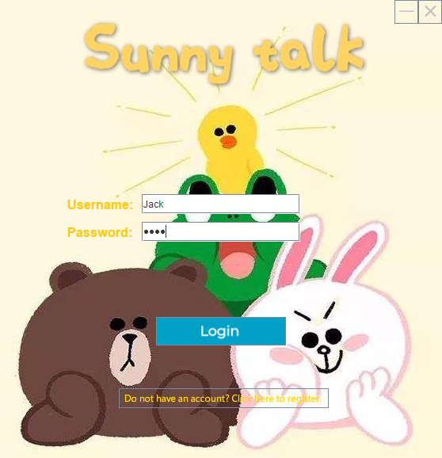
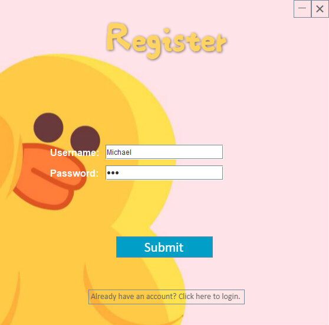
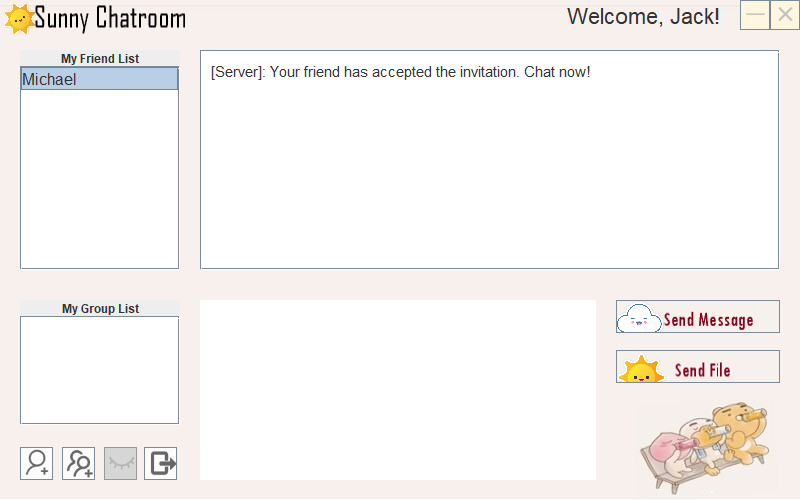
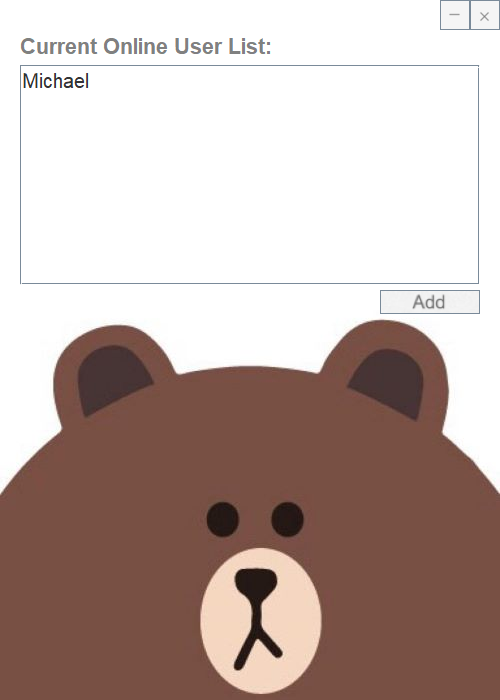
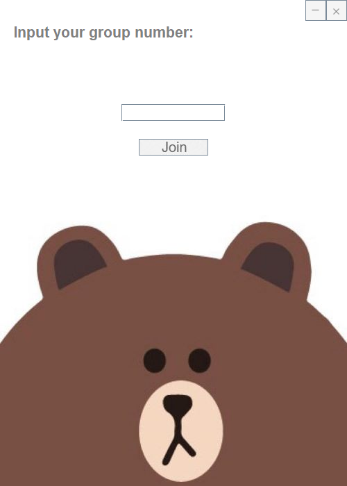
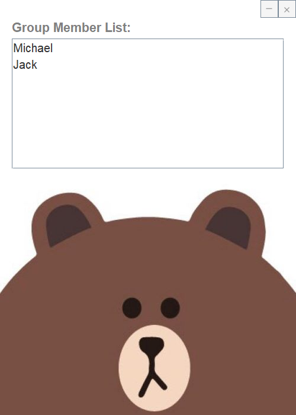

# SunnyChat

A simple chat application written in Java RMI.

This is a course work project for _COMP4073 - Distributed Computing Systems_, and **it is far from finish**. Please read its code and use it for learning purposes only.

## Features

-   Database (MariaDB) for persistent storage

-   Account system (login & register with username and password)

-   Friend list & group list

-   Sending & responding friend invitations

-   Sending & receiving files

-   Online users list

-   Seperated message areas for different friends and groups

## Future improvements

-   Storing passwords after encryption

-   SSL transmission (maybe by utilizing [custom socket factory](https://docs.oracle.com/javase/8/docs/technotes/guides/rmi/socketfactory/SSLInfo.html)?)

-   Anti SQL injection

-   Sending & receiving images

-   Sending & receiving files in small pieces, but not the whole file (to save memory when sending large files)

## Runtime screenshots

## Launch guide

### Prerequisite

1. MariaDB database running on `localhost:3306` with account `root` and empty password.

2. JDK 8 x64

3. Java IDE (recommendations: Visual Studio Code, Eclipse 2020)

### To launch

1. Import the file [chat.sql](chat.sql) into the database.

2. Launch the [Server](src/server/Server.java) in the IDE.

3. Launch the [Client](src/client/Client.java) in the IDE.

4. Enjoy!
